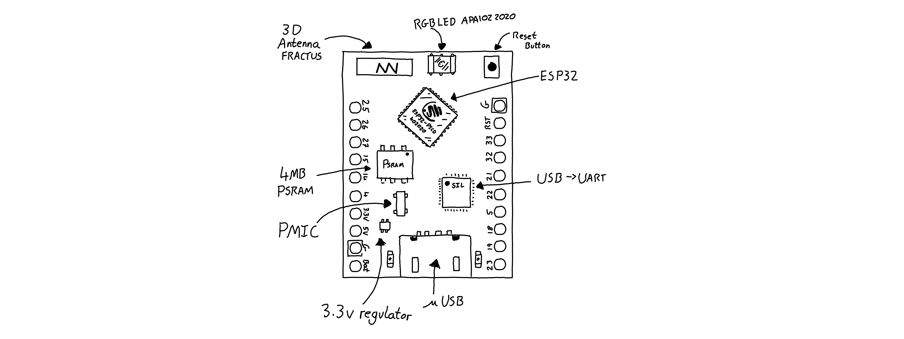
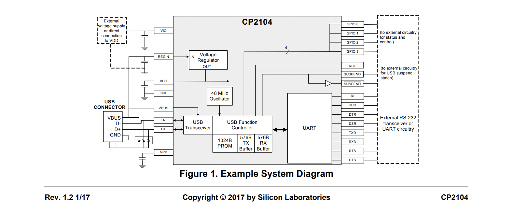

# EmSys Autumn 2021: Lecture 2
In this lecture we will explore:
* What a System-on-Chip is.
* Why C is the language of choice for programming such systems.
* The basics on an Arduino sketch. 

This will all be framed in the context of your TinyPico device.

## Your TinyPico

Above is a doodle of your TinyPico device showing _some_ of the components on the TinyPico printed circuit board (PCB). The heart of the system is the ESP32 microcontroller unit that contains two processor cores that are capable of running at 240MHz, along with a bunch of other goodies that we will explore in a little while.

However, there is a lot more than just the ESP32 on this board. There is an RGB LED, the APA102 2020, a USB to UART converter, a power management integrated circuit, and much much more. Each of these components can be considered an embedded system in their own right, and when combined together as they are on the TinyPico board they also make an embedded system. The point that I am attempting to make here, is that embedded systems are hierarchical. Embedded systems are made from embedded systems, which are made from embedded systems.  

Let's take just one example from the TinyPico board, the USB to UART Bridge chip. We can examine the datasheet [[here](https://www.silabs.com/documents/public/data-sheets/cp2104.pdf)] and see that this device is pretty complicated. (Don't worry I don't expect you to be able to understand this datasheet).

Looking at the system diagram for this device (taken from the datasheet) we can see that it has controller hardware, buffers for sending and receiving data, oscillators, and programmable memory. This is a dedicated digital circuit that needs to recieve, process, and transmit data with very precise timing guarantees. In isolation it is an embedded system in it's own right. 

